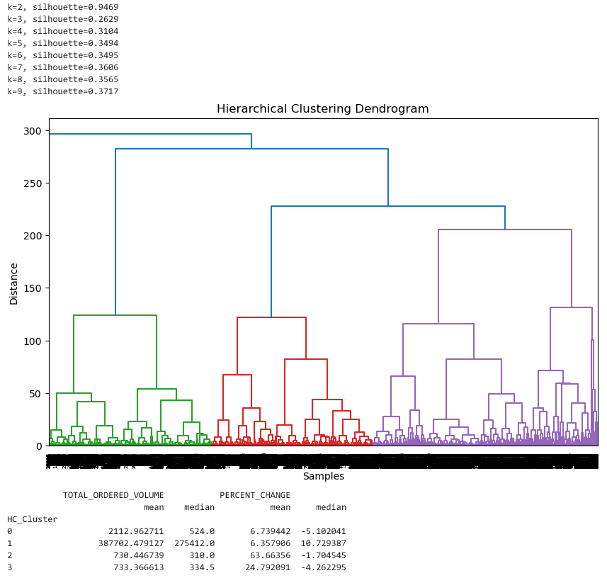
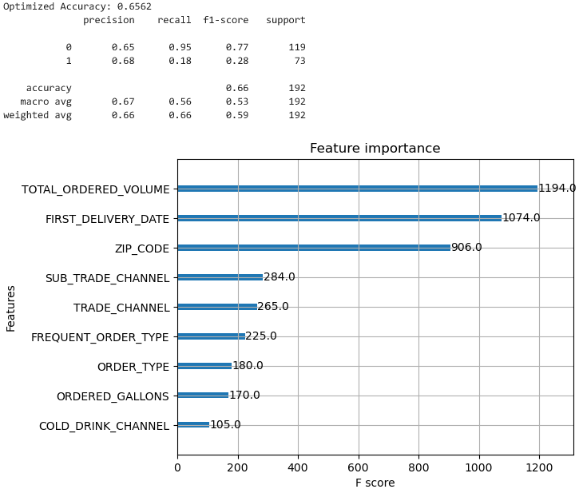
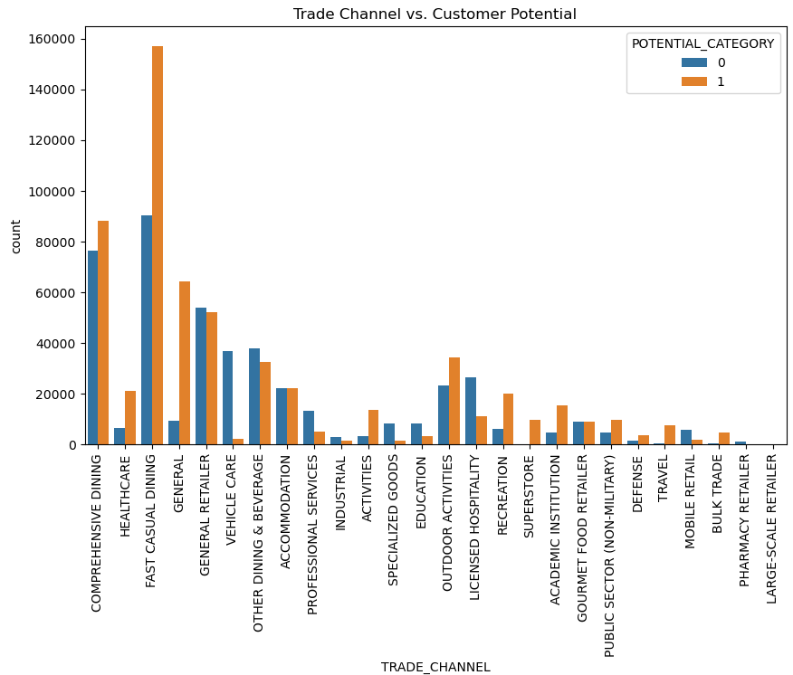
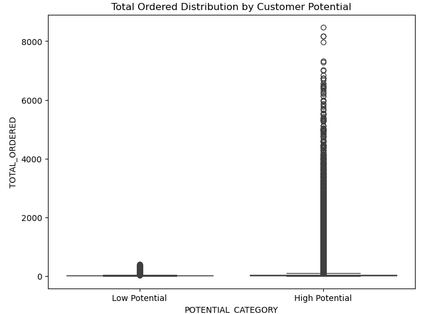

# IS6813-Portfolio
Tommaso Pascucci
IS 6813 Portfolio

# Swire Coca Cola Capstone 
## Business problem summary
Swire Coca Cola is one of the largest coca cola packers and distributors. Their business model is utilizing either red or white trucks, with white trucks being a third distributor and red trucks being their own fleet.
SCCU plans to optimize logistics by transitioning customers selling below a specific annual volume to an Alternate Route to Market (ARTM) or white truck delivery. This is intended to reduce delivery costs and improve operational efficiency. However, this approach poses a risk: some customers on the ARTM list may have the potential to exceed this volume threshold (and become very high volume Customers) through the organic growth of their business, or with active support from SCCU. Moving these growth-ready, or high-growth-potential customers to ARTM prematurely could hinder SCCU revenue growth and long-term business opportunities, as we do not have the same level of contact with Customers using ARTM.
 The objective of this project is to develop a predictive/classification model to determine whether a customer will be high or low growth, specifically in identifying important attributes, empowering Swire to make better-informed decisions

## Project objective
The primary goal of this project is to build models that can assist in identifying high and low growth customers with 2 distinct groups, first is the full data set and the second being the local market partners with fountain only and no CO2. By leveraging data from the Swire team, the project aims to:

* Identify and retain high growth potential customers.
* Move low growth customers.
* Determine which variables have a high importance in predictions.

## [Solution to a business problem]([https://github.com/CSJoyce/HomeCreditProject/blob/main/practiceProjectModeling2.Rmd](https://github.com/TommasoPascucci/IS6813-Portfolio/blob/main/Capstone.ipynb))
The solution involves a multi-step process:

Exploratory Data Analysis (EDA): Understand the data, identify patterns, and determine variable importance.
Data Cleaning: Handle missing values, remove outliers, and preprocess data for model training.
Feature Engineering: Create new features to enhance predictive power.
Model Development: Test various machine learning algorithms, including Logistic Regression and XGBoost, to find the most effective model.
Evaluation: Assess models using metrics such as accuracy, precision, recall, and F1-score to select the best-performing solution as well as finding variables which could be of high correlation to high potential customers.   

With the overall recommendation being to use HTE(Heterogeneous Treatment Effect) model specifically with a T learner for the overall treatment effect, though it is strongly recommended to compare these results with the other models as they showed strengths in different areas depending on whether false positives or false negatives are more or less acceptable.

## My contribution
I helped with some of the data cleaning (I came up with the target variable of growth from year over year as both a numeric valuae as well as a binary grothwer or not, with the intent that since we need to idntiyty wich variables are attributed to putentaily  high growth customers having a flat threshold didn't see like the best target varaible in this situation) and as a group decided how we wanted to handle missing values so that we all worked on the same cleaned data set when creating the models. I focused on creating the clustering and XGBoost models. 

### Clustering
Cluster 2 & 3 are smaller customers with higher growth potential — may warrant nurturing  
Cluster 2
* Low volume (≈ 730)
* Very high percent change (+63% mean) but median is slightly negative,  likely driven by big swings in a few cases. Suggests this group includes volatile or fast growing small customers  
Cluster  3
* Low volume (≈ 733)
* Moderate growth (+24% mean, -4.2% median). Similar to Cluster 2 but with less extreme growth  growing small accounts, or maybe rebounding ones

  
### XGBoost model (local market partners)
* 65.62% Accuracy
* 77% / 28% F1
* 95% / 18% Recall
* 65% / 68% Precision   

### [EDA]([https://github.com/TommasoPascucci/Portfolio/blob/main/EDA.Rmd](https://github.com/TommasoPascucci/IS6813-Portfolio/blob/main/EDA.ipynb))
Exploration included understanding feature importance and data distribution, as well as visualizing critical variables. For example, we observed Specific trade channels such as Fast Casual Dining seem to be correlated more with high growth:

We can also observe that there is a very large class imbalance between high and low growth as well as a big range in values between the 2 groups, which needs to be kept in mind when building models and interpreting outputs.

### [Modeling]([https://github.com/TommasoPascucci/Portfolio/blob/main/practiceProjectModeling2.Rmd](https://github.com/TommasoPascucci/IS6813-Portfolio/blob/main/Capstone.ipynb))
The modeling process involved testing multiple algorithms, with XGBoost emerging as the most effective solution in my notebook. Key steps included hyperparameter tuning, managing class imbalance, and optimizing thresholds.

## Business value of the solution
The predictive model developed through this project offers significant business value:

* Identify and retain high growth potential customers.
* Move low growth customers.
* Determine which variables have a high importance in predictions.

## Difficulties
The project encountered several challenges, including:

* Data Cleaning: Handling a large dataset with some missing values and outliers required careful preprocessing.
* Class Imbalance: The dataset was highly imbalanced, with far fewer default cases compared to non-defaults.
* Feature Importance: Identifying which features had the most predictive value was crucial for model performance.

over all the biggest difficulty was being able to select a good target variable for use to be able to conduct an analysis and ensure that the data is cleaned in a usable format. 
The next biggest challenge which we faced was being able to produce models that could identify key variables which could be of use in predicting which attributes care correlated to customers that would have a high growth potential. This required us to try lates of models and have to rework several with different layouts of data and different thresholds to be able to get a usable output.

## Learnings
This project reinforced the importance of:

* Spending significant time upfront on data cleaning and preprocessing, which simplifies downstream modeling efforts.
* Exploring and engineering features to maximize model performance.
* Allocating sufficient time for hyperparameter tuning to achieve the best results.

